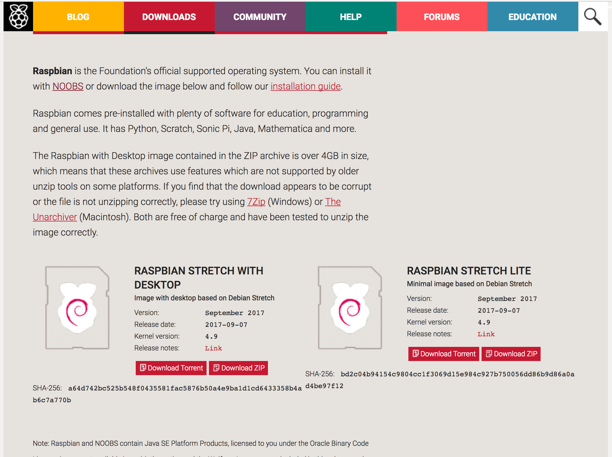
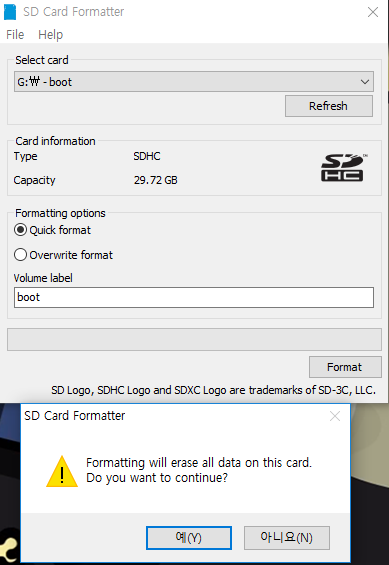
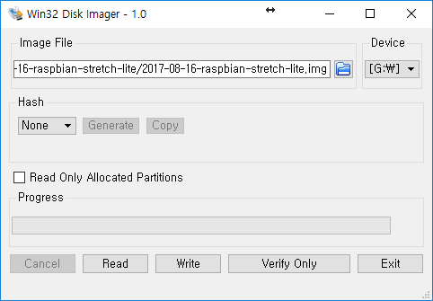
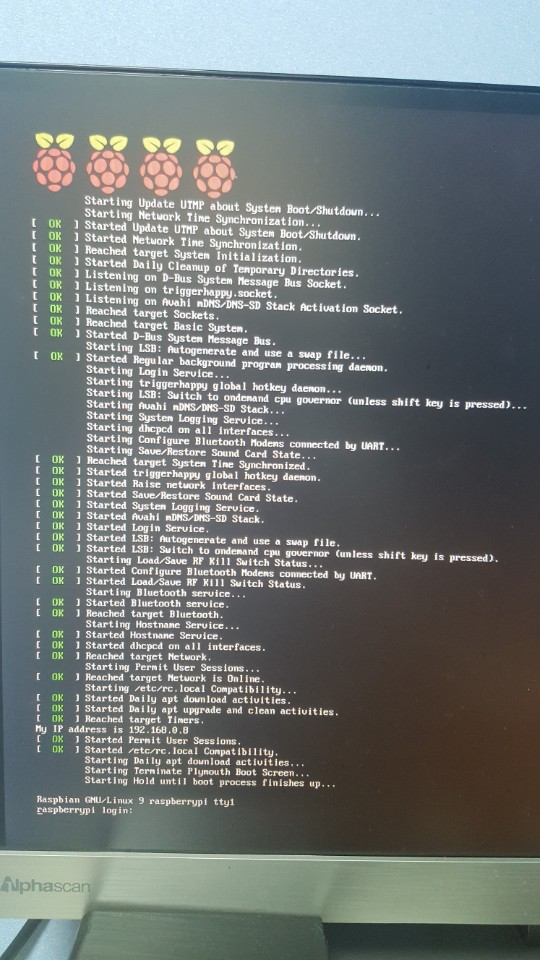

# 라즈베리파이3(Raspberry Pi3)

> 라즈베리파이3를 구입하고 라즈비안 OS를 설치

#### 1. OS 이미지 다운로드

[라즈비안OS 다운로드](https://www.raspberrypi.org/downloads/raspbian/) 공식사이트로 이동해서 디스크 이미지를 다운 받습니다.

 왼쪽에 있는 DESKTOP은 GUI가 포함된 OS 이고 오른쪽에 LITE는 콘솔모드로만 이용할 수 있습니다.
맨 처음에 GUI가 포함된 파일로 설치를 했었는데 기본적으로 깔려있는 것이 너무 많아서 다시 LITE로 설치했습니다.

일단 필요한 OS를 받았고 다운받은 디스크 이미지를 이제 SD카드에 이미지를 써야 합니다.

#### 2. SD카드 포맷

디스크 이미지를 쓰기 전에 SD카드를 포맷할 필요가 있습니다.

[sd카드 포맷 다운로드](https://www.sdcard.org/downloads/index.html) 로 이동해서 자신의 운영체제에 맞는 sd카드 포맷 프로그램을 다운받아서 설치하면 됩니다.

sd카드가 들어있는 디스크를 선택하고 포맷버튼을 클릭해서 포맷을 하면 됩니다.

#### 3. SD카드 이미지 쓰기

포맷한 SD카드에 이제 다운받은 라즈비안os를 쓰면 됩니다.

window와 macOS 별로 이미지를 쓰는 방법이 다 있지만 저는 데스크탑으로 사용하고 있는 window로 이미지를 굽겠습니다.

이미지를 구울때 필요한 프로그램을 다운로드 받습니다.

[win32diskimager](https://sourceforge.net/projects/win32diskimager/) ==> 링크를 누르면 다운로드 주소로 이동됩니다.

프로그램을 설치하고 실행합니다.

다운받은 이미지 파일을 선택해서 sd카드가 꽂혀있는 드라이브를 선택해서 Write를 시작합니다.
대략 5분정도 걸리는 것 같습니다.

이미지를 다 쓰고나서 window의 경우 디스크 형식이 linux이기 때문에 포맷을 하시겠습니까? 라는 경고창이 뜨는데
그냥 취소를 누르면 됩니다.

#### 4. 라즈비안OS 설치하기

이제 sd카드를 라즈베리파이에 삽입하고 전원을 연결하면 부팅이 시작됩니다.

