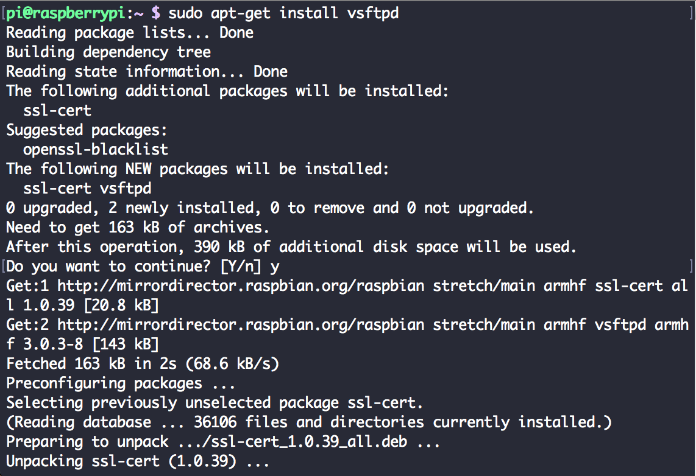
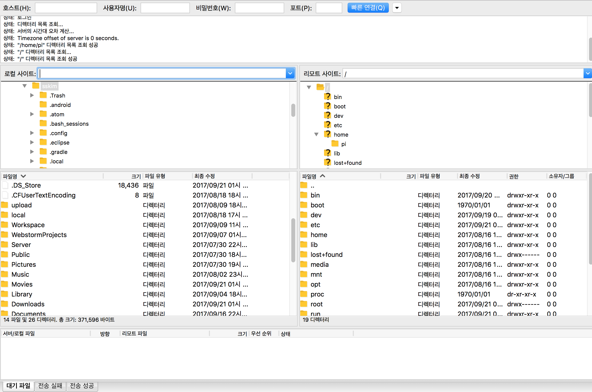

# 라즈베리파이 FTP 서버 만들기

이번에는 설치해 놓은 라즈베리파이를 파일서버로 활용하기 위해서
FTP 서버로 만들어 보겠습니다.

일단 라즈베리파이를 FTP서버로 만들어줄 vsftpd를 설치하면 됩니다.

<pre>
$sudo apt-get update
$sudo apt-get upgrade
$sudo apt-get install vsftpd
</pre>

> 시작 명령어
$sudo service vsftpd start

클라이언트 프로그램은 FileZilla 를 이용했습니다.

[파일질라](https://filezilla-project.org/)

---

<pre>
vsftpd 설정 파일의 위치
$sudo vi /etc/vsftpd.conf
</pre>

| 설정명 | 값 | 설명 |
| :------------- | :------------- | :-----|
| anonymous_enable | NO |  익명의 사용자 접속 허용 여부   |
| local_enable | YES | 로컬 계정 사용자의 접속 허용 여부 |
| write_enable | YES |  write 명령어 허용 여부 |
| local_umask | 022 |  로컬 계정 사용자용 umask |
| xferlog_enable | YES |  파일전송로그를 남길 것인지 여부 |
| xferlog_file | log 경로 (디폴트 /var/log/xgerlog) |  파일 전송 로그 경로 및 파일명 |
| xferlog_std_format	| YES |  xferlog 표준 포멧으로 로그를 남길지 여부 |
|chroot_local_user | YES |  홈 폴더에서 벗어날  없도록 할 지 여부|
|chroot_list_enable	| YES | 사용자 홈 디렉토리에서 상위로 접근하지 못하도록 하기 위한 설정으로, chroot_list 사용여부를 설정하고, 사용시 파일의 경로를 지정한다. |
| chroot_list_file | /etc/vsftpd.chroot_list | 위와 같음 |

[출처 : vsftpd.conf설정](http://freehoon.tistory.com/48)

설정후
<pre>
$sudo service vsftpd restart
</pre>
