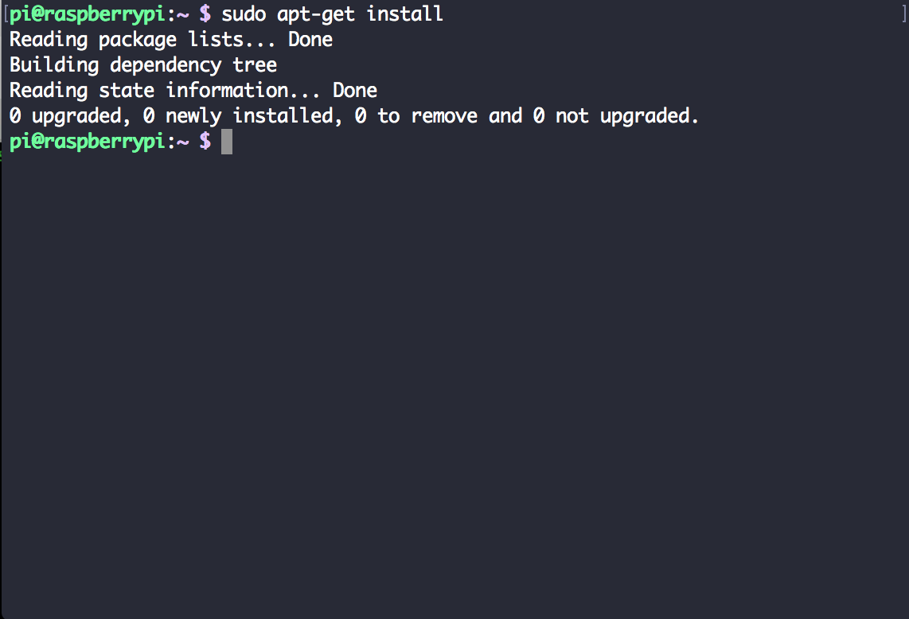
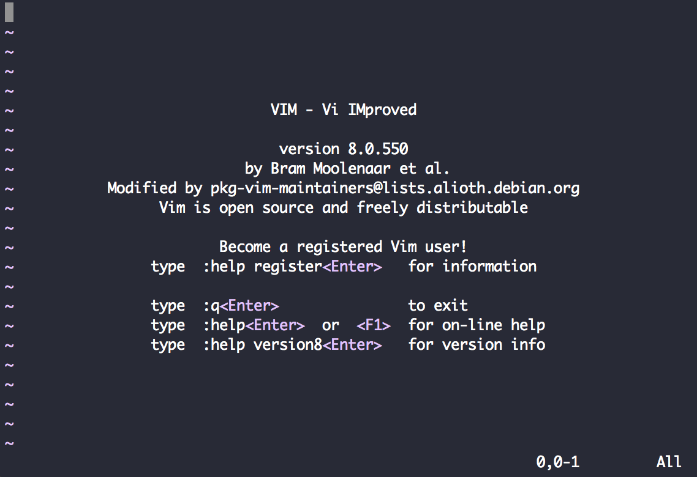
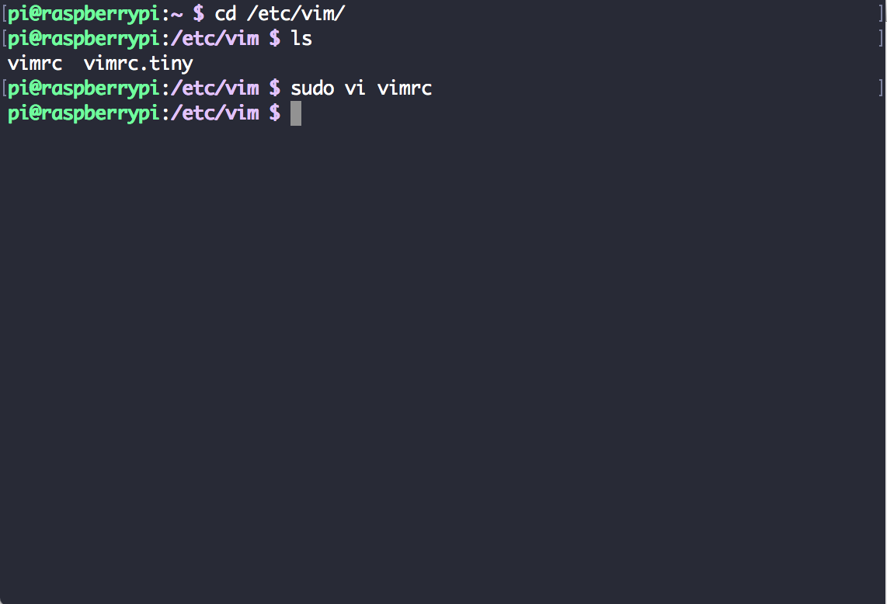
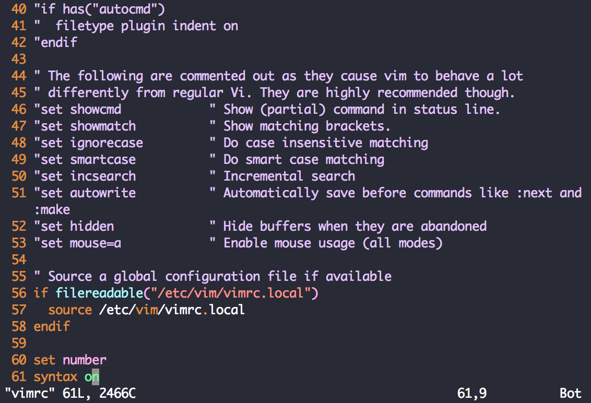

# 라즈베리파이 VIM 설치

vim은 리눅스 기본 vi editor를 향상시킨 문서 편집기 입니다.

설치

>
sudo apt-get update
sudo apt-get upgrade
sudo apt-get install vim

순서대로 입력하면 설치가 완료가 됩니다.

vim 설치를 확인 하려면 명령어에 vim을 입력하면 됩니다.

> $vim

성공적으로 설치가 되었습니다.

vim을 설치 이후에 설정을 할수가 있는데
설정 방법에는 2가지가 있습니다.
서버 관리자라면 /etc/vim/vimrc 파일을 변경해서 모든 사용자에게 동일한 환경을 제공해도 됩니다. 하지만, 서버운영상 기본설정은 놔두고 각 사용자마다 자유롭게 설정을 하려면 그냥 기본 디렉터리에 vi ~/.vimrc 를 만들어서 설정 명령어를 입력하면 됩니다.

> 첫번째 방법
cd /etc/vim 이동후에 vimrc 수정

60번째 부터 설정 명령어를 입력했습니다.

> 두번째 방법
vi ~/.vimrc 를 입력해서 설정 명령어를 입력하면 됩니다.
